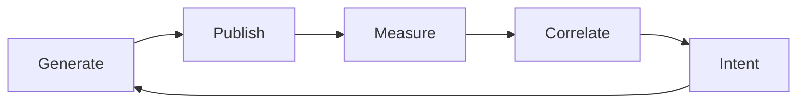

# Living Ambient Engine

> An autonomous content engine that decides what to create next based on what performed last.

A Python + FFmpeg procedural generation pipeline with a closed-loop analytics → statistical correlation → intent → generate → publish system. Dual channel (brand + personal). Runs headlessly on GitHub Actions. Specs and contracts in `docs/spec/`.

## How It Works



On schedule, when the planner emits a valid intent file, the engine generates parameterized ambient audiovisual content, publishes to YouTube, collects analytics, runs statistical correlation to find what's performing, and autonomously triggers the next generation batch. When signal is insufficient the planner emits BLOCKED and no upload occurs.

## Operating Model

- **Local:** `run_job.py`, `batch_generate.py`, `library_cli.py`
- **CI/CD:** GitHub Actions — Art Creator, Content Factory, scheduled analytics
- **Data loop:** Analytics JSON → reports → correlate → suggestions → plan intent (`run_intent`) → generate → upload
- **Dual advisory:** Parallel LLM synthesis (Gemini API + local Qwen GGUF) for report analysis and parameter-tuning suggestions
- **Autonomous upload:** Triggers automatically when planner emits a valid intent and signal clears trust gates. BLOCKED weeks produce no upload.

## 🤖 Agent-Ready

Built to be operated by AI agents. Specs, guardrails, and contracts in `docs/spec/`:

> **AI Agents:** [`docs/START_HERE.md`](docs/START_HERE.md) → [`.github/AGENT_INSTRUCTIONS.md`](.github/AGENT_INSTRUCTIONS.md) (includes [`GUARDRAILS`](docs/spec/GUARDRAILS.md) before changing generation).

> **New User?** [📚 Getting Started Guide](docs/GETTING_STARTED.md) | [⚡ Quick Reference](docs/QUICK_REFERENCE.md) | [🎨 Art Creator](docs/ART_CREATOR.md) | [❓ FAQ](docs/FAQ.md)

---

## 🎬 Gallery

Watch the outputs live — each piece is procedurally generated, continuously evolving, and never loops:

[](https://www.youtube.com/@living-ambient-engine)
[](https://www.youtube.com/@peterkrentel1027)

## What It Creates

Generative ambient art with:
- 🌀 **Evolving visuals** - 14 pattern types including fractals, sacred geometry, particle systems, and organic flows
- 🎵 **Dynamic soundscapes** - Layered audio that evolves through distinct phases, never loops
- 🧠 **Brainwave-aligned frequencies** - Delta, Theta, Alpha, Beta, Gamma tuning
- 🌊 **Nature ambiences** - Rain, ocean, fire, forest with authentic textures

## 🎨 NEW: Art Creator

**Your digital artist's palette** - Create unique parameterized videos with:
- 🎭 **9 Art historical periods** - From cave art to futuristic
- 🖼️ **7 Visual patterns** - Fractals, particles, sacred geometry
- 🎨 **11 Color palettes** - Or create your own with custom RGB
- 🎵 **9 Music styles** - World rhythms from heartbeat to tribal drums
- 🚀 **7 Dynamic journeys** - Synchronized audio-visual evolution (awakening, deep_dive, waves...)
- ⚡ **Full parameter control** - Speed, complexity, tempo, frequencies
- 🎲 **Reproducible seeds** - Recreate or share your exact creations

👉 **[Start Creating Art Now →](docs/ART_CREATOR.md)**

*Anyone can run the Art Creator workflow—no coding required!*

## Quick Start

```bash
# Clone and setup
git clone https://github.com/peterkrentel/living-ambient-engine.git
cd living-ambient-engine
python3 -m venv venv && source venv/bin/activate
pip install -r requirements.txt

# Try interactive examples
python examples.py

# Or generate a video directly
python run_job.py --mood trance --duration 60
```

**Or use GitHub Codespaces** - click "Code" → "Codespaces" → "Create codespace"

## Commands

```bash
# Single video
python run_job.py --mood deep_focus --duration 300

# Batch generation  
python batch_generate.py --moods all --durations 1h,2h

# Upload to YouTube
python youtube_upload.py --batch ./batch_output

# View content library
python library_cli.py stats
python library_cli.py search --mood deep_focus
python library_cli.py export
```

## 8 Mood Presets

Featured examples below — **`config/moods.yaml`** and workflows support **additional** presets (e.g. full brand SEO rotation). See [`docs/spec/workflows.md`](docs/spec/workflows.md).

| Mood | Brainwave | Frequency | Rhythm |
|------|-----------|-----------|--------|
| `deep_focus` | 40Hz Gamma | 432Hz | Taiko |
| `sleep` | 2Hz Delta | 528Hz | Heartbeat |
| `chill` | 10Hz Alpha | 639Hz | Gamelan |
| `study` | 12Hz Alpha | 432Hz | Taiko |
| `trance` | 6Hz Theta | 528Hz | Gnawa |
| `energize` | 25Hz Beta | 741Hz | Kuku |
| `ceremony` | 7Hz Theta | 528Hz | Candomble |
| `warrior` | 20Hz Beta | 741Hz | Burundi |

## Optional: Automated Publishing

If you want to publish to YouTube, the project includes CI/CD automation:
1. **GitHub Actions** - manual and (where enabled) scheduled workflows
2. **Batch processing** - Multiple moods x durations
3. **Auto-upload** - Direct to YouTube with metadata
4. **Content Library** - Catalog with links and metadata

See [docs/ARCHITECTURE.md](docs/ARCHITECTURE.md) for system diagrams.

## Project Structure

```
run_job.py           # Single video CLI
batch_generate.py    # Batch generation
youtube_upload.py    # YouTube upload CLI
library_cli.py       # Content library browser
content_catalog.json # Persistent video catalog with YouTube links
audio/               # Audio synthesis
visuals/             # Fractal/geometry generation  
render/              # FFmpeg pipeline
library/             # Content library management
config/moods.yaml    # Mood presets
.github/workflows/   # CI/CD automation
```

## Setup YouTube API (one-time)

1. Go to console.cloud.google.com
2. Create project, enable "YouTube Data API v3"
3. Create OAuth2 credentials (Desktop app)
4. Download client_secrets.json to project root
5. Run: python youtube_upload.py --auth
6. Add token to GitHub Secrets as YOUTUBE_TOKEN_B64

See [docs/youtube-auth.md](docs/youtube-auth.md) for detailed instructions.

## Documentation

- 📑 **[Markdown inventory](docs/MARKDOWN_INDEX.md)** - What every `.md` in the repo is for (includes [`docs/archive/`](docs/archive/) playbooks)
- 🎨 **[Art Creator Guide](docs/ART_CREATOR.md)** - Your digital artist's palette
- 📚 **[Getting Started Guide](docs/GETTING_STARTED.md)** - Complete tutorial with examples
- ⚡ **[Quick Reference](docs/QUICK_REFERENCE.md)** - Command cheat sheet
- 📖 **[Content Library](docs/CONTENT_LIBRARY.md)** - Track videos with YouTube links
- ❓ **[FAQ](docs/FAQ.md)** - Common questions answered
- 💡 **[Use Cases](docs/USE_CASES.md)** - Real-world applications
- 🏗️ **[Architecture](docs/architecture.md)** - System design and diagrams
- 📺 **[YouTube Setup](docs/youtube-auth.md)** - Authentication guide
- 🗺️ **[Master Plan](docs/master-plan.md)** - Roadmap and milestones
- 🔗 **[Cohesion Roadmap](docs/COHESION_ROADMAP.md)** - Integration plan: ledgers, data loop, catalog, versioning
- ⚙️ **[Execution policy](docs/EXECUTION.md)** - GitHub Actions + project venv only (no ad-hoc system Python)
- 🤝 **[Contributing](CONTRIBUTING.md)** - How to contribute
- 🤖 **[AI Agent Instructions](.github/AGENT_INSTRUCTIONS.md)** - For AI coding assistants

## What Can I Do With This?

**Living Ambient Engine helps you:**
- ✅ Create generative ambient art - unique, evolving audiovisual experiences
- ✅ Produce long-form meditation/focus/sleep content
- ✅ Explore algorithmic art and procedural generation
- ✅ Publish to YouTube with automated CI/CD (optional)

**Perfect for:**
- Artists exploring generative/procedural art
- Meditation and wellness creators
- Ambient music producers
- Anyone interested in algorithmic creativity

👉 **[See What You Can Create →](docs/GETTING_STARTED.md#examples-gallery)**

## License

MIT - See LICENSE

