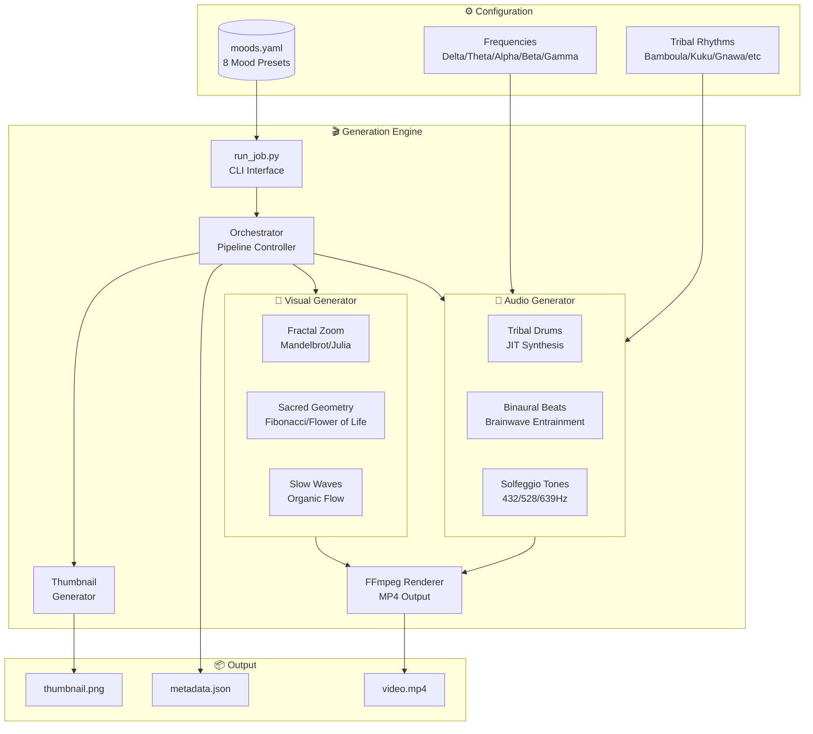
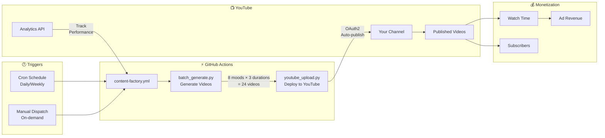
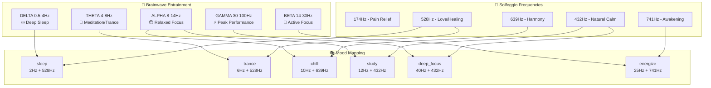
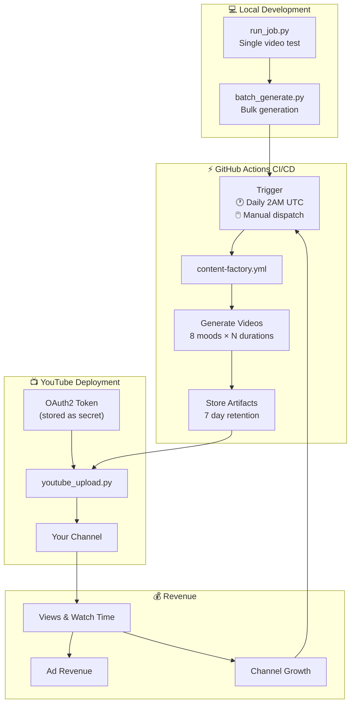

# Living Ambient Engine - Architecture

## System Architecture

```mermaid
flowchart TB
    subgraph Config["⚙️ Configuration"]
        MOODS[("moods.yaml\n8 Mood Presets")]
        FREQ["Frequencies\nDelta/Theta/Alpha/Beta/Gamma"]
        TRIBAL["Tribal Rhythms\nBamboula/Kuku/Gnawa/etc"]
    end
    
    subgraph Engine["🎬 Generation Engine"]
        CLI["run_job.py\nCLI Interface"]
        ORCH["Orchestrator\nPipeline Controller"]
        
        subgraph Visual["🎨 Visual Generator"]
            FRACTAL["Fractal Zoom\nMandelbrot/Julia"]
            SACRED["Sacred Geometry\nFibonacci/Flower of Life"]
            WAVES["Slow Waves\nOrganic Flow"]
        end
        
        subgraph Audio["🎵 Audio Generator"]
            DRUMS["Tribal Drums\nJIT Synthesis"]
            BINAURAL["Binaural Beats\nBrainwave Entrainment"]
            SOLFEGGIO["Solfeggio Tones\n432/528/639Hz"]
        end
        
        RENDER["FFmpeg Renderer\nMP4 Output"]
        THUMB["Thumbnail\nGenerator"]
    end
    
    subgraph Output["📦 Output"]
        VIDEO["video.mp4"]
        META["metadata.json"]
        PNG["thumbnail.png"]
    end
    
    MOODS --> CLI
    FREQ --> Audio
    TRIBAL --> Audio
    CLI --> ORCH
    ORCH --> Visual
    ORCH --> Audio
    Visual --> RENDER
    Audio --> RENDER
    ORCH --> THUMB
    RENDER --> VIDEO
    ORCH --> META
    THUMB --> PNG
```

## Content Factory Pipeline (CI/CD)

```mermaid
flowchart LR
    subgraph Trigger["🕐 Triggers"]
        SCHEDULE["Cron Schedule\nDaily/Weekly"]
        MANUAL["Manual Dispatch\nOn-demand"]
    end
    
    subgraph GitHub["⚡ GitHub Actions"]
        WORKFLOW["content-factory.yml"]
        BATCH["batch_generate.py\nGenerate Videos"]
        UPLOAD["youtube_upload.py\nDeploy to YouTube"]
    end
    
    subgraph YouTube["📺 YouTube"]
        CHANNEL["Your Channel"]
        VIDEOS["Published Videos"]
        ANALYTICS["Analytics API"]
    end
    
    subgraph Revenue["💰 Monetization"]
        ADS["Ad Revenue"]
        WATCH["Watch Time"]
        SUBS["Subscribers"]
    end
    
    SCHEDULE --> WORKFLOW
    MANUAL --> WORKFLOW
    WORKFLOW --> BATCH
    BATCH --> |"8 moods × 3 durations\n= 24 videos"| UPLOAD
    UPLOAD --> |"OAuth2\nAuto-publish"| CHANNEL
    CHANNEL --> VIDEOS
    VIDEOS --> WATCH
    WATCH --> ADS
    VIDEOS --> SUBS
    ANALYTICS --> |"Track\nPerformance"| WORKFLOW
```

## Brainwave Frequency Map

```mermaid
flowchart TB
    subgraph Brainwaves["🧠 Brainwave Entrainment"]
        DELTA["DELTA 0.5-4Hz\n💤 Deep Sleep"]
        THETA["THETA 4-8Hz\n🧘 Meditation/Trance"]
        ALPHA["ALPHA 8-14Hz\n😌 Relaxed Focus"]
        BETA["BETA 14-30Hz\n🎯 Active Focus"]
        GAMMA["GAMMA 30-100Hz\n⚡ Peak Performance"]
    end
    
    subgraph Moods["🎭 Mood Mapping"]
        SLEEP["sleep\n2Hz + 528Hz"]
        TRANCE["trance\n6Hz + 528Hz"]
        CHILL["chill\n10Hz + 639Hz"]
        STUDY["study\n12Hz + 432Hz"]
        FOCUS["deep_focus\n40Hz + 432Hz"]
        ENERGY["energize\n25Hz + 741Hz"]
    end
    
    subgraph Solfeggio["🎵 Solfeggio Frequencies"]
        S174["174Hz - Pain Relief"]
        S432["432Hz - Natural Calm"]
        S528["528Hz - Love/Healing"]
        S639["639Hz - Harmony"]
        S741["741Hz - Awakening"]
    end
    
    DELTA --> SLEEP
    THETA --> TRANCE
    ALPHA --> CHILL
    ALPHA --> STUDY
    BETA --> ENERGY
    GAMMA --> FOCUS
    
    S528 --> SLEEP
    S528 --> TRANCE
    S639 --> CHILL
    S432 --> STUDY
    S432 --> FOCUS
    S741 --> ENERGY
```

## Complete Pipeline Flow

```mermaid
flowchart TB
    subgraph Local["💻 Local Development"]
        DEV["run_job.py\nSingle video test"]
        BATCH["batch_generate.py\nBulk generation"]
    end
    
    subgraph GitHub["⚡ GitHub Actions CI/CD"]
        TRIGGER["Trigger\n🕐 Daily 2AM UTC\n🖱️ Manual dispatch"]
        WORKFLOW["content-factory.yml"]
        GEN["Generate Videos\n8 moods × N durations"]
        ARTIFACT["Store Artifacts\n7 day retention"]
    end
    
    subgraph YouTube["📺 YouTube Deployment"]
        AUTH["OAuth2 Token\n(stored as secret)"]
        UPLOAD["youtube_upload.py"]
        CHANNEL["Your Channel"]
    end
    
    subgraph Money["💰 Revenue"]
        VIEWS["Views & Watch Time"]
        ADS["Ad Revenue"]
        GROWTH["Channel Growth"]
    end
    
    DEV --> BATCH
    BATCH --> TRIGGER
    TRIGGER --> WORKFLOW
    WORKFLOW --> GEN
    GEN --> ARTIFACT
    ARTIFACT --> UPLOAD
    AUTH --> UPLOAD
    UPLOAD --> CHANNEL
    CHANNEL --> VIEWS
    VIEWS --> ADS
    VIEWS --> GROWTH
    GROWTH --> TRIGGER
```

